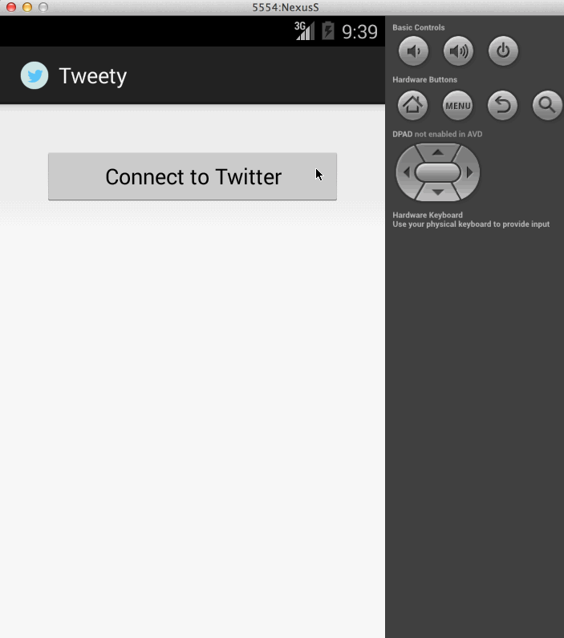

##### **Week 3 Project** : [Twitter Client](https://yahoo.jiveon.com/docs/DOC-3187)

**Description** :  
     
     This is a simple Twitter client that supports viewing a Twitter timeline and composing a new tweet.
    

**User Stories Covered** :
    
    *   User can sign in using OAuth login flow
    *   User can view last 25 tweets from their home timeline
           - User should be able to see the user, body and timestamp for tweet
           - User should be displayed the relative timestamp for a tweet "8m", "7h"
    *   User can load more tweets once they reach the bottom of the list using "infinite scroll" pagination
    *   User can compose a new tweet
           - User can click a “Compose” icon in the Action Bar on the top right
           - User will have a Compose view opened
           - User can enter a message and hit a button to post to twitter
           - User should be taken back to home timeline with new tweet visible
           - (Optional): User can see a counter with total number of characters left for tweet

    
    
**User Stories Left** :
    
    *   (Optional): User can refresh tweets timeline by pulling down to refresh (i.e pull-to-refresh)
    *   (Optional): User can open the twitter app offline and see last loaded tweets
                    - Tweets are persisted into sqlite and can be displayed from the local DB
    *   (Optional): User can tap a tweet to display a "detailed" view of that tweet
    *   (Optional): User can select "reply" from detail view to respond to a tweet 
    *   (Optional): Improve the user interface and theme the app to feel twitter branded
    *   (Stretch):  User can see an embedded media (image) within tweet detail view
    *   (Stretch):  Compose View activity is replaced with a modal overlay

***Time spent around 18 hours***  

**Walkthrough of app** : 
  
